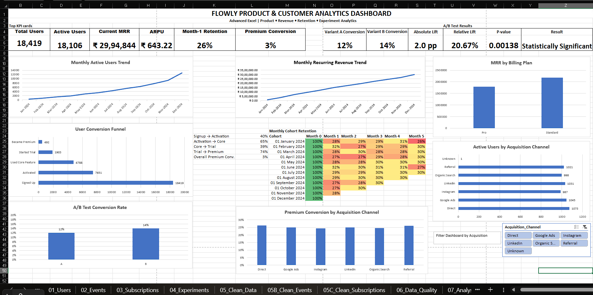
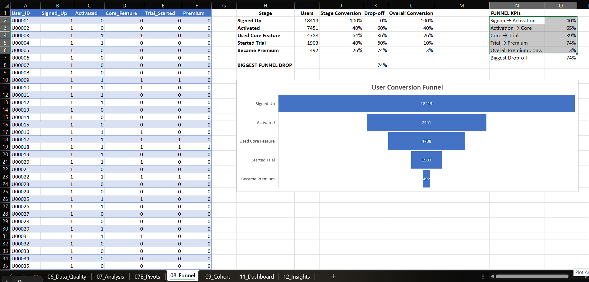
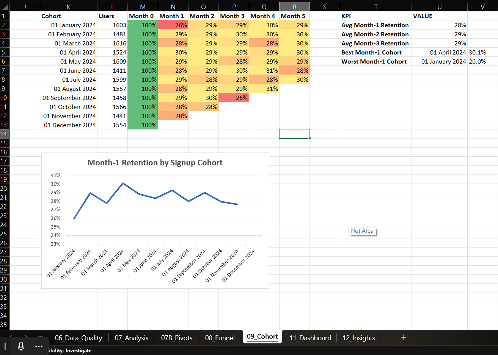
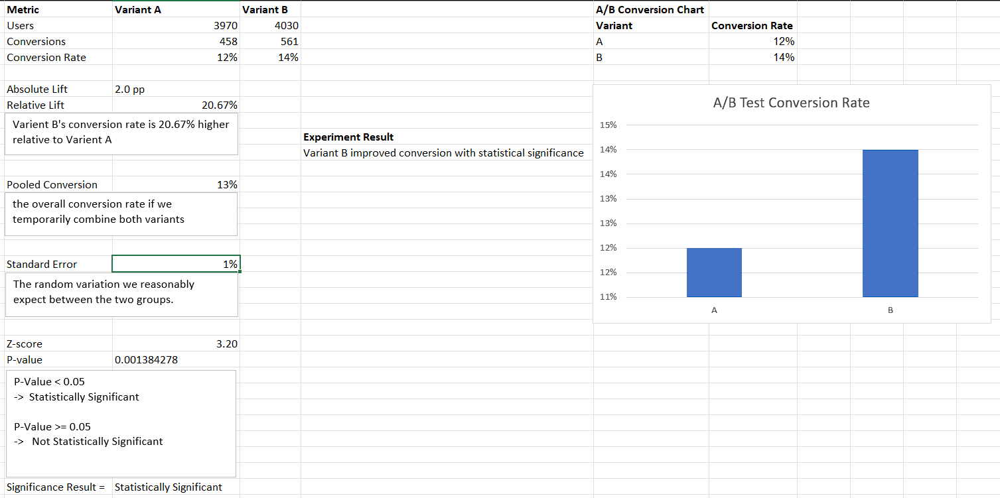
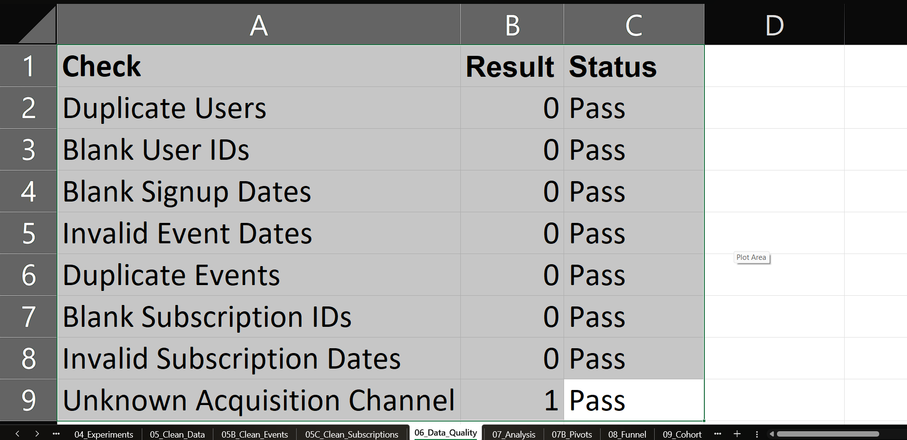

Flowly Product & Customer Analytics — Advanced Excel

-> Project Overview

Built an end-to-end "Product & Customer Analytics project using Advanced Excel".

The project analyzes "18,419 users and 75K+ product events" to understand product usage, customer behavior, revenue, funnel performance, cohort retention, acquisition channels, and A/B testing.

---

-> Tools & Skills Used

- Advanced Excel
- Power Query
- PivotTables
- PivotCharts
- Slicers
- XLOOKUP
- COUNTIFS
- SUMIFS
- FILTER
- UNIQUE
- Data Cleaning
- Data Validation
- Funnel Analysis
- Cohort Analysis
- Retention Analysis
- Revenue Analysis
- A/B Testing
- Dashboarding
- Data Visualization

---

-> Key Metrics

- Total Users: 18,419
- Active Users: 18,106
- Current MRR: ₹29.95L
- ARPU: ₹643.22
- Signup → Activation: 40.5%
- Activation → Core Usage: 64.3%
- Core → Trial: 39.7%
- Trial → Premium: 25.9%
- Overall Premium Conversion: ~3%
- Variant A Conversion: 11.5%
- Variant B Conversion: 13.9%
- Absolute Lift: +2.0 pp
- Relative Lift: +20.7%
- P-value: 0.00138

---

-> Dashboard

The dashboard tracks:

- Monthly Active Users
- Monthly Recurring Revenue
- ARPU
- Subscription revenue
- Funnel conversion
- Cohort retention
- Acquisition channels
- A/B test results

---

-> Funnel Analysis

> Funnel Results

- "40.5%" Signup → Activation
- "64.3%" Activation → Core Usage
- "39.7%" Core → Trial
- "25.9%" Trial → Premium
- Around "3%" of total signups became Premium users

> Key Insight

The biggest product opportunity is improving activation and trial-to-premium conversion.

---

-> Cohort Retention Analysis

> Key Insight

Observed Month-1 retention stayed around the "high-20% range" across several cohorts.

> Recommendation

Improve early user engagement using better onboarding, feature discovery, reminders, and habit-forming workflows.

---

-> A/B Testing

> Experiment Result

- "Variant A Conversion:" 11.5%
- "Variant B Conversion:" 13.9%
- "Absolute Lift:" +2.0 percentage points
- "Relative Lift:" +20.7%
- "P-value:" 0.00138

> Conclusion

Variant B performed better than Variant A and the result was "statistically significant" because the p-value was below 0.05.

---

-> Data Quality Checks

Performed checks for:

- Duplicate users
- Duplicate events
- Blank IDs
- Missing signup dates
- Invalid subscription dates
- Unknown acquisition channels
- Data type validation

---

-> Power Query ETL

Used Power Query to:

- Clean raw user, event, and subscription data
- Standardize text fields
- Handle missing values
- Remove duplicates
- Convert date fields
- Create month, quarter, and year columns
- Prepare analysis-ready tables

---

-> Key Business Insights

- MAU reached its highest level in "December".
- Current MRR reached approximately "₹29.95L".
- Only "40.5%" of signups reached activation.
- Trial-to-Premium conversion was "25.9%".
- Overall Premium conversion was around "3%".
- Major acquisition channels showed similar Premium conversion rates.
- Variant B improved experiment conversion from "11.5% to 13.9%".
- The A/B result was statistically significant with "p = 0.00138".

---

-> Recommendations

- Improve onboarding to increase activation.
- Guide users toward core features earlier.
- Improve trial-to-paid messaging and upgrade offers.
- Focus on first-month engagement to improve retention.
- Compare acquisition cost and retention before increasing channel spend.
- Consider a broader rollout of Variant B while monitoring downstream retention and revenue.

---

-> Project Workflow

Raw Data  
↓  
Power Query Cleaning  
↓  
Data Quality Checks  
↓  
Excel Analysis  
↓  
PivotTables & PivotCharts  
↓  
Funnel + Cohort + A/B Testing  
↓  
Interactive Dashboard  
↓  
Business Insights & Recommendations  

---

-> Project File

The complete Excel workbook is available in this repository:

`Flowly_Product_Analytics_Advanced_Excel_Project.xlsx`

Open it in Microsoft Excel to explore the full dashboard, formulas, Power Query transformations, PivotTables, slicers, cohort analysis, funnel analysis, and A/B testing.

---

-> About the Project

This project was created as a portfolio project to demonstrate practical "Data Analyst and Product Analyst skills using Advanced Excel".

It focuses on turning raw data into useful business insights, product metrics, and decision-making recommendations.
